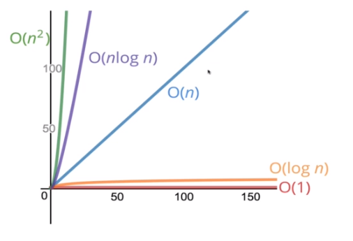

# Big 0 Notation

Big O Notation is a fuzzy way of describing the time or space complexity of an algo. We want to either know how the runtime changes depending on how a function operates, or how the space complexity changes. Big O notation depends only on the code, not on what machine is running the code.

**O(n)** - Refers to an algo that time scales or grows objects as its input becomes larger
**O(1)** - Refers to an algo that remains constant with its input
**O(n^2)** - Refers to an algo that 

Big O Notation is simplified based on how many operations an algo has. For example, an algo might have a true time complexity of **O(n + 5)** but on a grand scale this is meaningless and would be referred to as an **O(n)** algorithm. At the scale of millions those 5 extra operations become meaningless. We usually just pick the larger. For example **O(n^2 + n^3)** simplifies to **O(n^3)**.

- When counting operations we count operators + assignments

Space complexity works the same but instead focuses on the amount of objects created by a function. For example, this function has a space complexity of **O(1)** because it will always create one variable, 'var i = 1'.

```javascript
1.  function logUpTo(n) {
2.   for (var i = 1; i <= n; i++) {
3.   console.log(i);
4.   }
5.  }
```

But this function has a space complexity of **O(n)** because we create an array of a variable length dependent upon our input

```javascript
1.  function onlyElementsAtEvenIndex(array) {
2.   var newArray = Array(Math.ceil(array.length / 2));
3.   	for (var i = 0; i < array.length; i++) {
4.   		if (i % 2 === 0) {
5.   		newArray[i / 2] = array[i];
6.   	}
7.   }
8.   return newArray;
9.  }
```

## O(log n)

log(base)2(8) = 3

We're asking 2^x = 8

x = 3

A function with a log n complexity is seen as very good, the next level above a 1 complexity

log*base2(value) = exponent ---> 2^exponent = value

Recursive functions can have log space complexities




